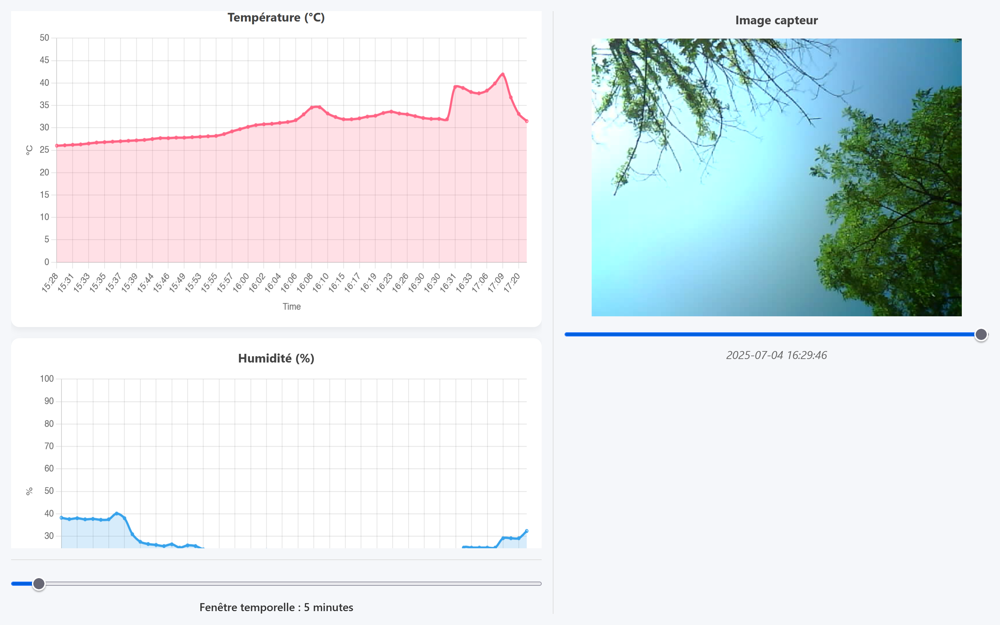

# Station météo

Objectif : réaliser une station autonome pour suivre la météo depuis le jardin des Mines.
Moyens :
- Programme d'identification des nuages reposant sur un algorithme de machine learning.
- Design d'une interface pour la lecture des données.
- Modélisation et impression 3D d'un boîtier résistant à l'eau pour l'électronique. 
Mesures envisagées : température, humidité, pression, CO2, vitesse et direction du vent, précipitations.

Matériel utilisé :
- Raspberry Pi 4 (Model B) : hub de contrôle, réception des mesures, hébergement du serveur
- ESP32 Camera : photo des nuages pour ML
- SEN-DHT22 : mesure de température et d'humidité
- BME280 : mesure de pression
- Arduino Uno R4 Wifi : traitement des données de l'anémomètre
- Laser et photorésistance : détection de passage pour l'anémomètre
- Batteries lithium 3.6V
- Convertisseur 5V 

Modélisation et impression 3D :
- Conception d'un boîtier pour l'électronique, adapté aux capteurs, utilisation d'inserts en laiton
- Fabrication d'un anémomètre utilisant un laser et une photo résistance (méthode de mesure analogue à celle d'un codeur incrémental)
- Design d'un support pour deux batteries lithium 3.6V (utilisation d'un convertisseur pour alimenter les composants en 5V)

Architecture de programmation :
- Fichiers type "capteur.py" récupérant les données des différents capteurs, achetés ou fabriqués
- Store_data.py : collecte les mesures et les insère dans la base de données SQL toutes les x secondes. La base est constituée de plusieurs tables, une table par capteur. Les tables ont toutes le même type : id / date / valeur.
- App.py : gestion du serveur via Flask avec un Dashboard interactif
- Dossier static/images : stockage des images prises 
Pour le capteur ESP32-Camera, on lance un serveur sur la carte de l'ESP et on récupère les données en faisant les requêtes depuis le Raspberry. On fait la même chose pour l'anémomètre mais avec une carte Arduino Uno. Les capteurs de température, humidité et pression sont connectés au Raspberry en filaire (ports GPIO).
On a aussi rajouté un script qui lance automatiquement le serveur après reboot du raspberry.

Les bibliothèques Python utilisées :
- torch
- torchvision
- pillow
- sklearn
- numpy
- matplotlib
- seaborn
- requests
- sqlite3
- Adafruit_DHT
- board
- serial
- smbus2
- bme280
- flask
- pysqlite

Pour afficher simplement le dashboard, il suffit d'installer :
- flask
- pysqlite

Pour lancer l'application complète, avec le recueil et enregistrement de données, exécutez le fichier `main.py`. Pour lancer simplement le dashboard, exécutez le fichier `app.py`.

Auteurs du projet : Baptiste Michaud, Mikhail Kataevskii, Adrian Dabas & Nathan Mornand
